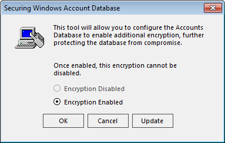
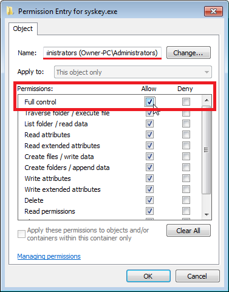
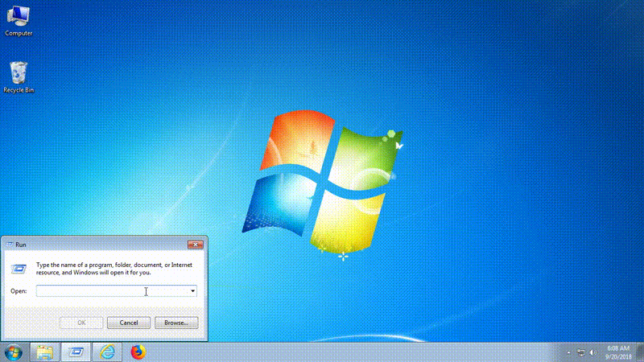

# SCAM Lock Tool

A replacement for SAM Lock Tool (better known as syskey). Tech support scammers use syskey to lock their victims out of their computer by encrypting the account credentials stored inside the SAM file. With SCAM Lock Tool they won't be able to encrypt SAM.

## How to replace syskey

</img>

Replacing a system file is not as easy as a copy and paste, you need to take ownership over the file. To do so:

- Go to `C:\Windows\System32` and right click on `syskey.exe`
- Click **Properties**, open the **Security** tab, click the **Advanced** button, then open the **Owner** tab
  - As you can see the owner of the file is **TrustedInstaller** and not your current account
- Click the **Edit** button (in Windows 10, it’s **Change**) and select the *Administrators* group
- Click the **OK** button
  - The current owner is now the **Administrators** group (which includes your account assuming you are an administrator)
- Click **OK** until you have closed all properties windows and are back to the Explorer screen
- Right-click on **syskey.exe** and click **Properties > Security tab > Advanced button** again
- Click the **Change permissions...** button, select **Administrators** from the list and then click the **Edit...** button
- Tick the box next to **Full Control** and click **OK** until you close all the dialogs
  - Windows will ask you: "*You are about to change the permission settings on system folders* [...] *Do you want to continue?*", confirm with **Yes**

Now you can rename **syskey.exe** in **syskey.exe.bak** to make a backup. At this point all you have to do is paste my syskey.exe inside system32.

## Command line arguments

SCAM Lock Tools accepts the following command line arguments to customize its behaviour

| Argument | Description |
|----------|-------------|
| --no-wikipedia | The program will return a normal error without opening the Technical Support Scam [Wikipedia page](https://en.wikipedia.org/wiki/Technical_support_scam). |
| --no-error | The program will not return an error and will not open the Technical Support Scam [Wikipedia page](https://en.wikipedia.org/wiki/Technical_support_scam). |
| --success | The program will not return an error and will not open the Technical Support Scam [Wikipedia page](https://en.wikipedia.org/wiki/Technical_support_scam). |

## Preview

You can see this fake syskey in action below.

